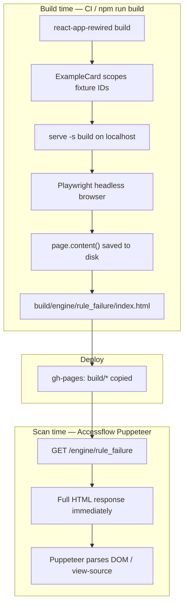

# Accessflow-Readable Success/Failure Pages

## Goal

Make URLs like:

- `https://jayquake.github.io/engine/aria-controls-has-reference_success`
- `https://jayquake.github.io/engine/aria-controls-has-reference_failure`

readable by **Accessflow / Puppeteer** — fixture HTML (`role="tab"`, `aria-controls`, buttons, etc.) visible in the **initial HTTP response** (view-source) — while **keeping the full React UI** (sidebar, ExampleCards, nav, interactions).

## Success criteria

1. `view-source` on a `_success` / `_failure` URL shows fixture markup, not the `404.html` redirect stub
2. Puppeteer `page.content()` or `request.get()` without waiting for JS contains `[data-audit-example]` and fixture elements
3. Live browser visit still shows the full interactive RAIDEN UI
4. `aria-controls-has-reference` (and similar ID-based rules) audit correctly — no duplicate `id` collisions across examples on one page
5. Library table and example nav use `<a href>` for crawl discovery (in progress)

---

## Problem

### Primary: No static file on GitHub Pages

Deep routes have no physical HTML file. GitHub Pages returns [`public/404.html`](public/404.html):

```html
<title>Redirecting...</title>
<body></body>
```

Fixtures only exist after JS: redirect → React → dynamic import → `dangerouslySetInnerHTML`.

### Secondary: Duplicate IDs on multi-example pages

Multiple ExampleCards on one page reuse `id="panel-1"`, `id="tab-1"`. The RAIDEN rule uses `document.getElementById()` document-wide ([`aria-controls-has-reference/index.ts`](src/components/pages/engine-rules/aria-controls-has-reference/index.ts)) — collisions cause wrong pass/fail results.

### Not the problem

| Claim | Reality |
|-------|---------|
| `dangerouslySetInnerHTML` not viable | **Viable** — inserts real DOM nodes; [`interactive-target-size-failure.spec.js`](sdk/tests/playwright/node/tests/interactive-target-size-failure.spec.js) proves SDK audit works once DOM exists |
| `networkidle + 500ms` too thin | **Irrelevant** — existing tests wait on visibility assertions before `audit()`, not arbitrary timeouts |
| Must drop React UI for view-source | **No** — prerender snapshots the full rendered UI |

---

## Solution: Build-time prerender + ID scoping

### How prerender relates to Puppeteer (key concept)

Prerender runs **once at build/deploy**, not when Accessflow scans.



| When | What runs | What Puppeteer/scanner gets |
|------|-----------|----------------------------|
| **Build** | Playwright visits each route, saves HTML | Static files written to `build/engine/{slug}/index.html` |
| **Deploy** | `gh-pages` copies `build/*` | Files live at `jayquake.github.io/engine/...` |
| **Scan** | Accessflow requests URL | **Saved prerender HTML** in first response — UI + fixtures, no 404 stub |

Prerender does **not** run on every scan. It produces the HTML files that Puppeteer reads.

### What Puppeteer sees after fix

**Without JS (raw fetch / view-source):**

- Full `<div id="root">` with MUI sidebar, ExamplePageNav, ExampleCards
- Fixture elements inside `[data-audit-example]` sections
- `<script src="/static/js/main....js">` tags (ignored if JS disabled)

**With JS enabled:**

- Same prerendered HTML paints immediately
- React `createRoot` remounts `#root` ([`index.js`](src/index.js) — no hydration)
- Full interactive UI returns; behavior unchanged for users

---

## Implementation plan

### Phase 1 — Fixture DOM markers + ID scoping (React app)

**[`src/utils/scopeExampleHtml.js`](src/utils/scopeExampleHtml.js)** (new)

- Prefix `ex-{index}-` on `id`, `aria-controls`, `aria-labelledby`, `for`, `href="#..."`
- Example: `id="panel-1"` → `id="ex-0-panel-1"`

**[`src/components/layout/ExampleCard.jsx`](src/components/layout/ExampleCard.jsx)**

- Wrap rendered output:
  ```html
  <section data-audit-example={index} data-rule-id={ruleId} data-variant={variant} aria-label="...">
  ```
- Apply `scopeExampleHtml(html, index)` before `dangerouslySetInnerHTML`
- Keep `dangerouslySetInnerHTML` — no change to render mechanism

**[`src/components/layout/UnifiedExamplePage.jsx`](src/components/layout/UnifiedExamplePage.jsx)**

- Wrap page content in `<main data-scan-ready="true" data-rule-id={ruleId} data-variant={variant}>`

### Phase 2 — Playwright prerender script

**[`scripts/prerender-example-pages.js`](scripts/prerender-example-pages.js)** (new)

1. Spawn `serve -s build -l 5000` (or use existing serve pattern)
2. Load routes from [`public/engine-rules-metadata.json`](public/engine-rules-metadata.json) (`successUrl`, `failureUrl` per rule — ~320 URLs)
3. For each URL:
   - `page.goto(`http://127.0.0.1:5000${url}`)`
   - `page.waitForSelector('[data-audit-example]', { timeout: 30000 })`
   - Optional: wait for `networkidle` + heading visible (belt-and-suspenders)
   - `fs.writeFileSync(`build${url}/index.html`, await page.content())`
4. Parallelize (4–8 workers) to limit CI time
5. Log failures; exit non-zero if any route fails

**Output structure:**

```
build/engine/aria-controls-has-reference_success/index.html
build/engine/aria-controls-has-reference_failure/index.html
…
```

GitHub Pages serves `index.html` for `/engine/aria-controls-has-reference_failure` — bypasses `404.html`.

### Phase 3 — Build + deploy wiring

**[`package.json`](package.json):**

```json
"postbuild": "node scripts/prerender-example-pages.js"
```

Order: `prebuild` → `build` (CRA) → `postbuild` (prerender).

**[`.github/workflows/ci-test-deploy.yml`](.github/workflows/ci-test-deploy.yml):** No change expected — `cp -r build/*` already includes new `engine/` dirs.

**Local dev (`npm start`):** Unchanged — no prerender; React SPA only.

### Phase 4 — Href crawl discovery (parallel track)

Partial uncommitted work in:

- [`src/components/pages/Engine/EngineRulesTable.jsx`](src/components/pages/Engine/EngineRulesTable.jsx) — rule name/id as `RouterLink`
- [`src/components/layout/ExamplePageNav.jsx`](src/components/layout/ExamplePageNav.jsx) — rule ID link + path variables

Finish:

- ExamplePageNav: visible text links for Library, Success, Failure, Rule detail
- EngineRulesTable (library layout): EXAMPLES column with `_success` / `_failure` hrefs

Separate from prerender but helps Accessflow **discover** URLs.

### Phase 5 — Verification

**[`sdk/tests/playwright/node/tests/aria-controls-has-reference-static.spec.js`](sdk/tests/playwright/node/tests/aria-controls-has-reference-static.spec.js)** (new)

Requires `npm run build` first (prerendered output exists).

```js
// 1. Raw HTTP — simulates view-source / scanner without JS
const res = await request.get('/engine/aria-controls-has-reference_failure');
const html = await res.text();
expect(html).not.toContain('Redirecting...');
expect(html).toContain('data-audit-example');
expect(html).toContain('role="tab"');
expect(html).toContain('aria-controls');

// 2. Live UI — full React experience intact
await page.goto('/engine/aria-controls-has-reference_failure');
await expect(page.getByRole('heading', { name: /aria-controls/i })).toBeVisible();
await expect(page.getByText('Rendered Output:').first()).toBeVisible();
await expect(page.locator('[data-audit-example]').first()).toBeVisible();

// 3. SDK audit (optional alignment check)
const report = await sdk.audit();
expect(report).toBeTruthy();
```

**Manual check after deploy:**

1. `view-source:https://jayquake.github.io/engine/aria-controls-has-reference_success`
2. Confirm `<section data-audit-example` and `<span role="tab" aria-controls=` in source
3. Confirm page is interactive in browser (tabs, sidebar, ExampleCard actions)

---

## Rejected alternatives

| Option | Why rejected |
|--------|--------------|
| Minimal static-only HTML | Compromises UI |
| Hidden fixture layer outside `#root` | Duplicate DOM; audit double-count risk |
| SSR / react-snap / eject CRA | High churn; prerender achieves same outcome |
| `dangerouslySetInnerHTML` alone | Does not fix GitHub Pages view-source |
| Rely on 404.html SPA redirect | Empty body in initial response |

---

## Files to change

| File | Change |
|------|--------|
| [`src/utils/scopeExampleHtml.js`](src/utils/scopeExampleHtml.js) | **New** — ID/ARIA namespacing |
| [`src/components/layout/ExampleCard.jsx`](src/components/layout/ExampleCard.jsx) | Scoping + `data-audit-example` wrapper |
| [`src/components/layout/UnifiedExamplePage.jsx`](src/components/layout/UnifiedExamplePage.jsx) | `<main data-scan-ready>` landmark |
| [`scripts/prerender-example-pages.js`](scripts/prerender-example-pages.js) | **New** — build-time Playwright snapshots |
| [`package.json`](package.json) | `postbuild` hook |
| [`src/components/layout/ExamplePageNav.jsx`](src/components/layout/ExamplePageNav.jsx) | Finish href nav links |
| [`src/components/pages/Engine/EngineRulesTable.jsx`](src/components/pages/Engine/EngineRulesTable.jsx) | EXAMPLES column hrefs |
| [`sdk/tests/playwright/node/tests/aria-controls-has-reference-static.spec.js`](sdk/tests/playwright/node/tests/aria-controls-has-reference-static.spec.js) | **New** — raw HTML + live UI tests |

## Implementation order

1. `scopeExampleHtml` + ExampleCard + UnifiedExamplePage markers
2. `prerender-example-pages.js` + `postbuild` hook
3. Run `npm run build` locally; verify `build/engine/aria-controls-has-reference_failure/index.html` in view-source
4. Verification spec
5. Finish href nav (can ship in same PR or follow-up)
