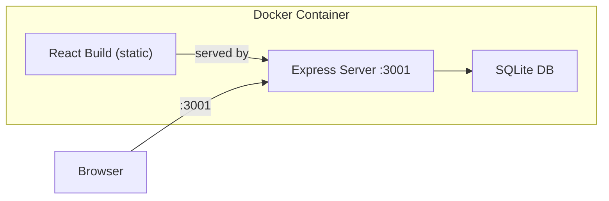

# Dockerize the Full Application

## Architecture

The app has three layers that need containerization:



In production mode, the Express server at port 3001 serves both the API routes and the React static build from `../../build`. This means a single container can serve the entire app.

## Key Details from Codebase

- **Backend entry:** `server/src/server.ts` -> compiled to `server/dist/server.js`
- **Backend port:** `process.env.PORT || 3001`
- **Database:** SQLite at `server/prisma/data/test-runner.db`
- **Static serving:** Express serves `../../build` (frontend) and `/mcp-output` (screenshots)
- **Backend build:** `tsc` (needs a `server/tsconfig.json` which may be missing)
- **Frontend build:** `npm run build` -> `build/` directory

## Changes

### 1. Add `server/tsconfig.json` (if missing)

The server `build` script runs `tsc` and expects output in `dist/`. A dedicated tsconfig is needed:

```json
{
  "compilerOptions": {
    "target": "ES2020",
    "module": "commonjs",
    "outDir": "dist",
    "rootDir": "src",
    "strict": true,
    "esModuleInterop": true,
    "resolveJsonModule": true,
    "skipLibCheck": true
  },
  "include": ["src/**/*"]
}
```

### 2. Create `Dockerfile` (multi-stage production build)

A multi-stage build that:

1. **Stage 1 (deps):** Install all npm dependencies for both root and server
2. **Stage 2 (build):** Build the React frontend (`npm run build`) and compile the server (`cd server && npm run build`)
3. **Stage 3 (production):** Copy only the built artifacts, install production deps, generate Prisma client, and run

Key considerations:

- Use `node:20-slim` as the base
- The server references `../../build` for static files, so the directory layout in the image must match the monorepo structure (or adjust the path via env var)
- SQLite data directory (`server/prisma/data/`) should be a Docker volume for persistence
- Run `npx prisma generate` and `npx prisma db push` at startup
- Expose port 3001

### 3. Create `docker-compose.yml` (local dev)

For local development with hot-reload:

- Mount the source code as volumes
- Use `npm run dev:full` (concurrently runs frontend + backend)
- Map port 3000 (frontend) and 3001 (backend)
- Persist SQLite data via a named volume
- Pass env vars from a `.env` file

Also include a `docker-compose.prod.yml` variant that builds and runs the production image.

### 4. Create `.dockerignore`

Exclude `node_modules`, `build`, `server/dist`, `.git`, test results, and other non-essential files.

### 5. Create `.env.example`

Document all environment variables the app uses with sensible defaults, so anyone cloning the repo knows what to configure.

### 6. Also finish the static-projects fix (from previous plan)

The `loadProject` function in `TestLibrary` still needs the static-mode handling completed. This was in progress when the Docker question came up. I will finish wiring it so GitHub Pages also works.

## What This Enables

- **Local:** `docker compose up` -- full app running at `localhost:3001`
- **Cloud:** Push the production image to any container registry, deploy to Cloud Run, Fly.io, Railway, etc.
- **GitHub Pages:** Static-only mode still works (project cards render, backend features show a banner)
