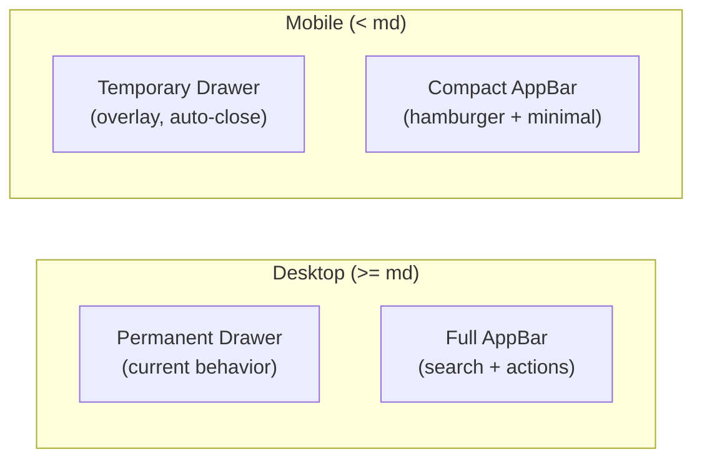

# Mobile Layout Enhancements

## Problem

The app has three main mobile layout issues:

1. **Permanent sidebar always takes space** -- The `Drawer` is `variant="permanent"` at all breakpoints, so on mobile the 60px collapsed sidebar wastes screen real estate and the content area is cramped.
2. **No way to toggle sidebar from AppBar** -- The drawer toggle lives inside the drawer header, which is hard to find and not standard UX.
3. **AppBar grid overflows on narrow screens** -- The toolbar uses `gridTemplateColumns: "auto minmax(200px, 400px) auto"` which doesn't collapse gracefully below ~500px.

## Approach

Use a single `md` breakpoint (960px) as the mobile/desktop dividing line.

## Changes

### 1. App.js -- Responsive drawer and AppBar

File: [src/App.js](src/App.js)

- Add `useMediaQuery` and `useTheme` imports from MUI.
- Detect mobile: `const isMobile = useMediaQuery(theme.breakpoints.down('md'))`.
- **Drawer variant**: `variant={isMobile ? "temporary" : "permanent"}`. When temporary, add `onClose={() => setOpen(false)}` and `ModalProps={{ keepMounted: true }}`. On mobile the drawer should be full `drawerWidth` (300px) when open and completely hidden when closed (no 60px collapsed rail).
- **Drawer root width**: On mobile, set to `0` when closed (drawer is off-screen) and `drawerWidth` when open.
- **AppBar**: On mobile, remove the margin-left shift so it spans full width. Add a hamburger `IconButton` with `MenuIcon` to the left section of the toolbar (only visible on mobile).
- **Auto-close on navigate**: Pass an `onCloseMobile` callback to `RuleTreeSidebar` so that on mobile, clicking any nav item also closes the drawer.
- **Main content area**: On mobile, remove the flex offset from the permanent drawer so content takes full width.

### 2. App.js -- Responsive AppBar toolbar

The toolbar currently uses a 3-column CSS grid with `minmax(200px, 400px)` for the search. On mobile:

- Switch to `display: "flex"` with `justifyContent: "space-between"` instead of the fixed grid.
- Hide the search bar on mobile (`display: { xs: "none", md: "flex" }`), or collapse it to an icon that expands on tap (simpler: just hide it since the dashboard and sidebar both have search).
- Keep the dark mode toggle, notification bell, and avatar in a compact row.
- Hide the "Ready" test status chip on mobile (already hidden on `xs`).

### 3. RuleTreeSidebar -- Mobile close-on-navigate

File: [src/components/layout/RuleTreeSidebar/index.jsx](src/components/layout/RuleTreeSidebar/index.jsx)

- Accept a new prop `onCloseMobile` (optional callback).
- In `handleNavigate`, call `onCloseMobile?.()` after navigating so the temporary drawer closes when a rule or page is selected.
- In collapsed mode on mobile, this won't apply since the drawer is fully hidden (no collapsed rail).

### 4. Home.jsx -- Minor mobile polish

File: [src/components/pages/Home.jsx](src/components/pages/Home.jsx)

- The dashboard grids are already reasonably responsive (stat cards are `xs={6} sm={3}`, coverage is `xs={6} sm={4} md={3}`). Minor tweaks:
  - Reduce header font size on xs: `fontSize: { xs: "1.5rem", sm: "2rem" }` for the "Rule Library" heading.
  - Tighten vertical spacing on xs: `mb: { xs: 2, sm: 4 }` for section gaps.
  - Ensure the "Jump to Rule" search field doesn't overflow on narrow screens.

## What stays the same

- Desktop behavior is completely unchanged -- permanent drawer with open/collapsed toggle.
- All routing, tree navigation, leaf items, localStorage persistence remain the same.
- Home.jsx grid breakpoints for stat cards and coverage sections already work well.
