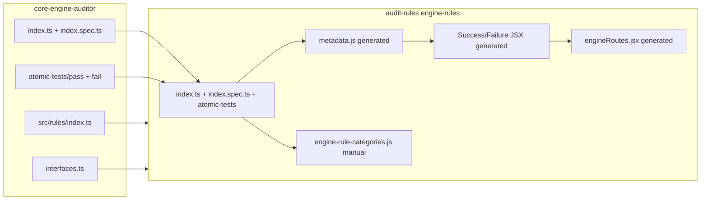

# Sync Engine Rules from core-engine-auditor

## Current state

| Metric                            | core-engine-auditor | audit-rules (stale)   |
| --------------------------------- | ------------------- | --------------------- |
| Rule directories                  | **167**             | **162**               |
| Atomic pass fixtures              | **836**             | **748**               |
| Atomic fail fixtures              | **590**             | **540**               |
| Changed `index.ts` (shared rules) | —                   | **157 of 158** differ |

**Rules only in core-engine** (add): `captcha-accessible-provider-2.0`, `captcha-accessible-provider-2.2`, `control-field-visible-and-tabbable`, `footer-navigation-discernible`, `header-navigation-discernible`, `inner-content-navigation-discernible`, `link-mismatch`, `list-item-misuse`, `search-input-dynamic-results-announcement`

**Rules only in audit-rules** (remove per your choice): `captcha-accessible-provider`, `list-item-within-list`, `navigation-submenu-discernible`, `navigation-submenu-region`

**Atomic gap on shared rules**: ~**72** HTML fixtures in core that are missing in audit-rules (49 pass, 23 fail); 3 audit-only fixtures not in core (will be removed with their rules).



## Phase 1 — Add a repeatable sync script

Create [`scripts/sync-engine-rules-from-core.js`](scripts/sync-engine-rules-from-core.js) in audit-rules to automate future updates.

**Behavior:**

- Accept `CORE_ENGINE_RULES` env var (default: `../../Desktop/core-engine-auditor/src/rules` relative to audit-rules)
- For each rule directory in core (skip `index.ts` file and `category-metadata.ts`):
  - Copy `index.ts`, `index.spec.ts` (if present), and entire `atomic-tests/` tree (including `assets/`)
  - Overwrite target rule folder contents for those files
- Copy [`interfaces.ts`](src/components/pages/engine-rules/interfaces.ts) from core
- Copy barrel [`index.ts`](src/components/pages/engine-rules/index.ts) from core's [`src/rules/index.ts`](../../Desktop/core-engine-auditor/src/rules/index.ts)
- Delete audit-only rule directories listed above (and their generated `metadata.js`, `*Success.jsx`, `*Failure.jsx`)
- Print a summary: added / updated / removed rule counts

**Do not copy** generated UI files during sync — they are regenerated in Phase 3.

## Phase 2 — Validate atomic tests at the source

Before syncing, run core-engine's atomic test suite to confirm fixtures are valid:

```bash
cd /Users/jasonquaicoo/Desktop/core-engine-auditor
npm run test:e2e
```

This uses [`test/atomic/index.test.ts`](../../Desktop/core-engine-auditor/test/atomic/index.test.ts), which:

- Discovers all `src/**/atomic-tests/**/*.html`
- Parses `<!--testconfig ... -->` JSON (`testedClass`, `expect.passedNodes` / `failedNodes`)
- Asserts `pass/` fixtures yield `response.passed === true` and `fail/` yield `false`

If any tests fail, fix upstream in core-engine before syncing (do not patch audit-rules in isolation).

## Phase 3 — Sync and regenerate UI artifacts

```bash
cd /Users/jasonquaicoo/Documents/auditor-testing/audit-rules

# 1. Sync rule source files from core-engine
node scripts/sync-engine-rules-from-core.js

# 2. Regenerate UI layer (existing pipeline from docs)
node scripts/extract-rule-metadata.js
node scripts/aggregate-rule-metadata.js
node scripts/generate-rule-components-v2.js
node scripts/generate-engine-routes.js
```

Key generators (already exist):

- [`scripts/extract-rule-metadata.js`](scripts/extract-rule-metadata.js) — `index.ts` → `metadata.js` (regex parse, no imports executed)
- [`scripts/generate-rule-components-v2.js`](scripts/generate-rule-components-v2.js) — reads `atomic-tests/pass/` → `{Rule}Success.jsx`, `atomic-tests/fail/` → `{Rule}Failure.jsx` (strips `testconfig` comments)
- [`scripts/generate-engine-routes.js`](scripts/generate-engine-routes.js) — 3 routes per rule (`/engine/{id}`, `_success`, `_failure`)
- [`scripts/aggregate-rule-metadata.js`](scripts/aggregate-rule-metadata.js) — rebuilds [`src/data/engine-rules-metadata.json`](src/data/engine-rules-metadata.json)

Run [`scripts/fix-generated-components.js`](scripts/fix-generated-components.js) only if the generator produces known edge-case failures (check build output first).

## Phase 4 — Post-sync atomic parity validation

Add [`scripts/validate-atomic-tests-parity.js`](scripts/validate-atomic-tests-parity.js) that compares core vs audit rule-by-rule:

- For every rule dir in core, assert every `atomic-tests/**/*.html` exists in audit-rules with identical content (or at minimum identical basename set)
- Fail with a per-rule report if any pass/fail fixture is missing
- Confirm no orphan `atomic-tests/` remain under removed audit-only rules

Wire as a npm script (e.g. `"validate:atomic-parity"`) for repeatability.

**Expected outcome after sync:** audit-rules atomic counts match core (~836 pass, ~590 fail).

## Phase 5 — Update navigation categories

Edit [`src/data/engine-rule-categories.js`](src/data/engine-rule-categories.js) to mirror the new catalog:

| Action | Rule ID                                                                                                  | Target category (from core `metadata.category`) |
| ------ | -------------------------------------------------------------------------------------------------------- | ----------------------------------------------- |
| Remove | `captcha-accessible-provider`                                                                            | —                                               |
| Add    | `captcha-accessible-provider-2.0`                                                                        | Forms                                           |
| Add    | `captcha-accessible-provider-2.2`                                                                        | Forms                                           |
| Remove | `list-item-within-list`                                                                                  | —                                               |
| Add    | `list-item-misuse`                                                                                       | Lists                                           |
| Remove | `navigation-submenu-discernible`, `navigation-submenu-region`                                            | —                                               |
| Add    | `control-field-visible-and-tabbable`                                                                     | Forms                                           |
| Add    | `search-input-dynamic-results-announcement`                                                              | Forms                                           |
| Add    | `link-mismatch`                                                                                          | Interactive Content                             |
| Add    | `footer-navigation-discernible`, `header-navigation-discernible`, `inner-content-navigation-discernible` | Landmarks (or Navigation & Landmarks section)   |

Update the header comment from "162" to **167** rules. [`src/utils/engineRuleCount.js`](src/utils/engineRuleCount.js) derives count from categories automatically.

## Phase 6 — Build verification

```bash
cd /Users/jasonquaicoo/Documents/auditor-testing/audit-rules
npm run build
```

Spot-check a few rules with new atomic tests in the UI:

- `radio-mismatch` — 3 new pass + 1 new fail fixtures
- `page-no-meta-http-equiv-refresh` — 8 new fail fixtures
- `captcha-accessible-provider-2.0` / `2.2` — new rule pages render

Verify removed routes 404 or are gone from navigation: `/engine/navigation-submenu-discernible`, `/engine/list-item-within-list`.

## Notes and edge cases

- **Import paths**: Copied `index.ts` files use `~/rules/interfaces` (same as core). audit-rules already vendors [`interfaces.ts`](src/components/pages/engine-rules/interfaces.ts) locally; keep it in sync with core.
- **`list-item-misuse` id typo**: Core rule exports `id: "list-item-missuse"` (double-s). Copy as-is — do not "fix" during sync.
- **`profile` field**: Core uses `profile: ["Blind"]` (array); older audit copies sometimes have `profile: "Blind"` (string). Sync overwrites with core format; metadata extractor must handle both (already does).
- **No automated sync existed before** — the new script closes that gap for future core-engine updates.
